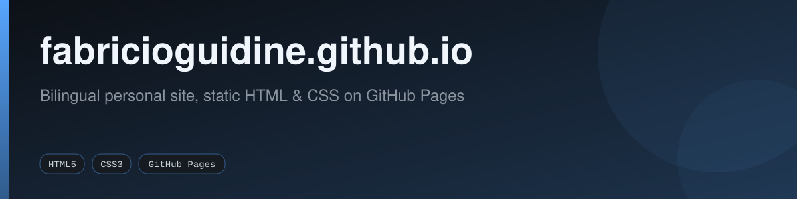

<div align="center">



[](https://github.com/fabricioguidine/fabricioguidine.github.io/actions/workflows/ci.yml) [](https://fabricioguidine.github.io) [](#) [](#) [](LICENSE)

</div>

> Bilingual personal site — static HTML & CSS, served by GitHub Pages.

This repository holds the source for the live site at <https://fabricioguidine.github.io>: a single-page personal site for Fabrício de Sousa Guidine (Senior QA Engineer / SDET). It is plain HTML and CSS with a small amount of vanilla JavaScript — no framework and no build step.

## Features

- Single-page layout with Hero, About, Experience, Skills, Projects, Education & Certifications, Research, and Contact sections.
- Bilingual EN / PT-BR: every translatable element carries `data-lang-en` / `data-lang-pt`, toggled by the top-right language button (`assets/js/lang.js`). The choice is detected from the browser and remembered via `localStorage`.
- Accessibility toolbar (`assets/js/a11y.js`): adjustable text size, high contrast, reduced motion, and link underlines, all persisted to `localStorage`.
- Dark mode via `prefers-color-scheme`, skip-link and semantic landmarks for keyboard / screen-reader navigation, and a print-friendly stylesheet.
- Schema.org `Person` JSON-LD embedded for search engines.

## How it works

```mermaid
flowchart LR
    HTML["index.html"] --> Pages["GitHub Pages<br/>(.nojekyll, serves files as-is)"]
    CSS["assets/css/styles.css"] --> Pages
    JS["assets/js/lang.js + a11y.js"] --> Pages
    Pages --> Live["https://fabricioguidine.github.io"]

    Btn["Language button"] -->|sets html[lang]| Toggle["lang.js"]
    Toggle -->|persist| LS["localStorage"]
    Toggle -->|CSS reveals matching<br/>data-lang-* nodes| Live
```

Switching languages does not reload the page: `lang.js` flips the `lang` attribute on `<html>`, and CSS shows or hides the `data-lang-en` / `data-lang-pt` variants accordingly.

## Local preview

No build is needed — any static file server works:

```bash
python -m http.server 8080
# open http://localhost:8080
```

Or, using the dev tooling shipped in `package.json`:

```bash
npm install
npm run serve   # http-server on :4000
```

## Deployment

The site is published with GitHub Pages directly from this repository's `main` branch. A `.nojekyll` file disables the Jekyll build so the files are served exactly as committed. Every push and pull request runs the CI workflow (`.github/workflows/ci.yml`): HTMLHint and html-validate, cspell (EN + PT-BR), lychee link checking, pa11y-ci accessibility checks, and Lighthouse CI.

## Project structure

```
.
├── index.html                 # single-page site, all sections
├── assets/
│   ├── css/styles.css         # design tokens + components
│   ├── js/lang.js             # EN/PT toggle, year stamp, copy-email
│   ├── js/a11y.js             # accessibility toolbar
│   ├── img/avatar.jpg         # hero avatar
│   └── cv/                    # downloadable CV PDF
├── .github/
│   ├── workflows/ci.yml       # CI: lint, a11y, spellcheck, lighthouse, links
│   └── dependabot.yml         # weekly npm + github-actions updates
├── .nojekyll                  # skip Jekyll build
├── package.json               # dev tooling (linters, a11y, lighthouse)
└── README.md
```

## License

[MIT](LICENSE)
